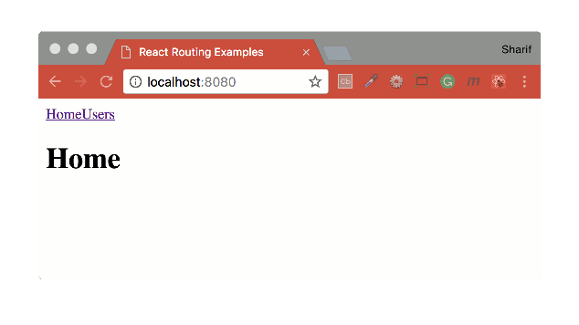
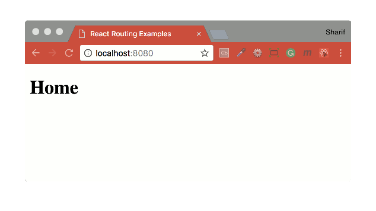

## React Router Examples
Manchester Codes - React Router Lecture Examples

#### Built with
* [npm](https://www.npmjs.com/) - Node Package Manager.
* [React](https://reactjs.org/docs/add-react-to-an-existing-app.html) - A JavaScript library for building user interfaces.
* [react-router-dom](https://www.npmjs.com/package/react-router-dom) - DOM bindings for React Router.

#### Installation
To run this project you will need to download it onto your local machine and install all dependencies.
Navigate inside the folder and install all dependencies by entering the following command on your terminal window:
```
npm install
```
Finally to run the server enter the following command in your terminal window:
```
npm start
```
This will run the server, open [http://localhost:8080](http://localhost:8080) to view it in the browser. If you make any changes and save the changes process will automatically refresh and you will be able to see the results in the browser.

If you want to end the process hold `control` and press `c` in mac, if you are not using mac hold `ctrl` and press `c`.

#### Route

```js
const Home = () => <h1>Home</h1>;
const Users = () => <h1>Users</h1>;

const App = () => (
  <div>
    <Route exact path="/" component={Home} />
    <Route path="/users" component={Users} />
  </div>
);
```

#### Link

```js
const Home = () => <h1>Home</h1>;
const Users = () => <h1>Users</h1>;

const App = () => (
  <div>
    <Link to="/">Home</Link>
    <Link to="/users">Users</Link>
    <Route exact path="/" component={Home} />
    <Route path="/users" component={Users} />
  </div>
);
```

#### Switch-1

```js
const Home = () => <h1>Home</h1>;
const Users = () => <h1>Users</h1>;
const NotFound = () => <h1>Not Found</h1>;

const App = () => (
  <div>
    <Route path="/users" component={Users} />
    <Route path="/:id" component={Home} />
    <Route component={NotFound} />
  </div>
);
```

#### Switch-2

```js
const Home = () => <h1>Home</h1>;
const Users = () => <h1>Users</h1>;
const NotFound = () => <h1>Not Found</h1>;

const App = () => (
  <Switch>
    <Route path="/users" component={Users} />
    <Route path="/:id" component={Home} />
    <Route component={NotFound} />
  </Switch>
);
```

#### Location

```js
const Home = () => <h1>Home</h1>;

const Details = ({ location }) => (
  <div>
    <h1>Details</h1>
    <ul>
      <li>{location.pathname}</li>
    </ul>
  </div>
);

const App = () => (
  <div>
    <Route exact path="/" component={Home} />
    <Route path="/details" component={Details} />
  </div>
);
```
